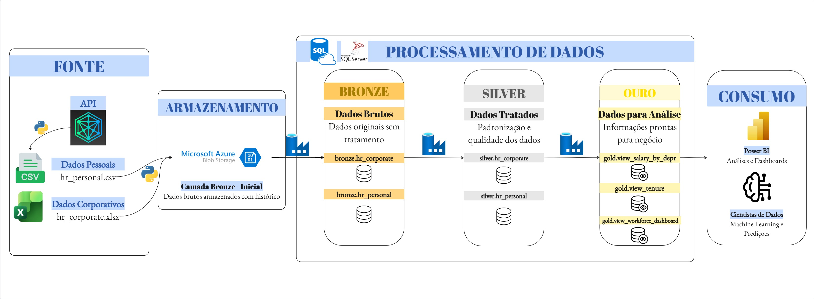
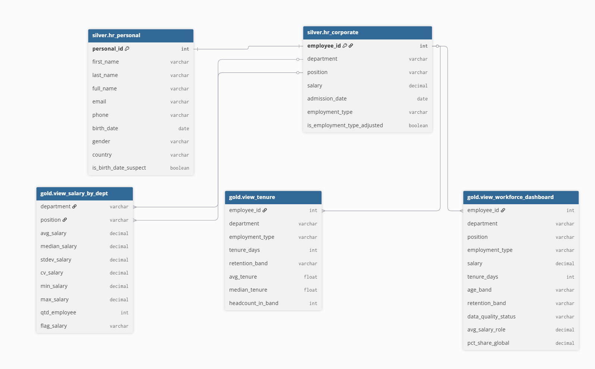
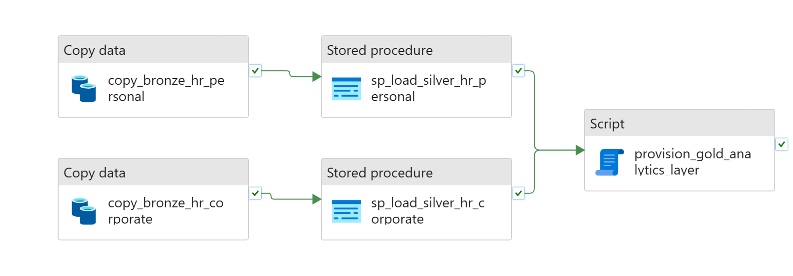

# 🎲👨‍💼 People Data Platform


---

## 📌 Visão Geral

Este projeto implementa um pipeline de dados para consolidação de informações de Recursos Humanos da **DataPeople Corp.**

A solução integra dados de múltiplas fontes (API e arquivos CSV), aplicando processos de padronização, validação e enriquecimento, com o objetivo de disponibilizar dados confiáveis para análise estratégica.

A arquitetura segue o modelo **Medalhão (Bronze → Silver → Gold)**, garantindo escalabilidade, governança e qualidade dos dados.

---

## 🏗️ Arquitetura



A solução utiliza serviços em nuvem da Azure:

- **Azure Storage Account** → armazenamento dos dados brutos  
- **Azure Data Factory** → orquestração do pipeline  
- **Azure SQL Database** → processamento e camada analítica  

---

## 🔄 Fluxo do Pipeline

1. Extração dos dados da API via Python  
2. Transformação inicial (normalização de endereço)  
3. Ingestão no Data Lake (Bronze)  
4. Processamento e padronização (Silver)  
5. Criação de views analíticas (Gold)  

---

## 📁 Estrutura do Projeto
```
case-ae/
│
├── data/
│
├── docs/
│   ├── data_dictionary.md
│   └── architecture.jpg
│
├── python/
│   ├── extract_hr_personal_data.py
│   ├── ingest_data_blob_storage.py
│   ├── transform_address.py
│   └── main.py
│
├── sql/
│   ├── bronze/
│   ├── silver/
│   ├── gold/
│   └── quality/
│
├── .env
└── README.md
```
---

## 📘 Data Dictionary

A documentação detalhada das tabelas (Bronze, Silver e Gold) está disponível em:

👉 [Data Dictionary](docs/data_dictionary.md)

---

## 📥 Fontes de Dados

### API (dados pessoais)

- employee_id  
- first_name  
- last_name  
- email  
- phone_number  
- birth_date  
- gender  
- address  

### CSV (dados corporativos)

- employee_id  
- department  
- position  
- salary  
- admission_date  
- employment_type  

---

## 🥉 Camada Bronze

Armazena os dados brutos sem transformação.

---

## 🥈 Camada Silver

Responsável pelo tratamento e padronização:

- Conversão de tipos  
- Padronização de campos  
- Tratamento de inconsistências  
- Validação de dados  

---

## 🥇 Camada Gold

Camada analítica com dados prontos para consumo:

- Métricas salariais por departamento  
- Tempo de empresa (tenure)  
- Visão consolidada da força de trabalho  

---

## 🧠 Modelo de Dados

<p align="center">
  
</p>

O modelo de dados representa a estrutura relacional da camada Silver, onde os dados pessoais e corporativos são integrados, servindo como base para a construção das views analíticas na camada Gold.

---

## 🔄 Pipeline (Azure Data Factory)

<p align="center">
  
</p>

O pipeline é orquestrado pelo Azure Data Factory e executa as etapas de ingestão, transformação e carga das camadas Bronze, Silver e Gold de forma automatizada.

---

## ✅ Qualidade de Dados

Validações implementadas:

- Verificação de valores nulos  
- Detecção de duplicidade  
- Validação de formatos  
- Identificação de inconsistências  

---

## ⚙️ Tecnologias Utilizadas

- Python  
- Azure Data Factory  
- Azure Storage  
- Azure SQL Database  

---

## 🎯 Objetivo

Fornecer uma base de dados confiável, padronizada e escalável para suportar análises estratégicas e tomada de decisão.

---
